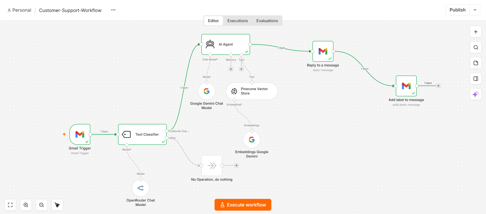
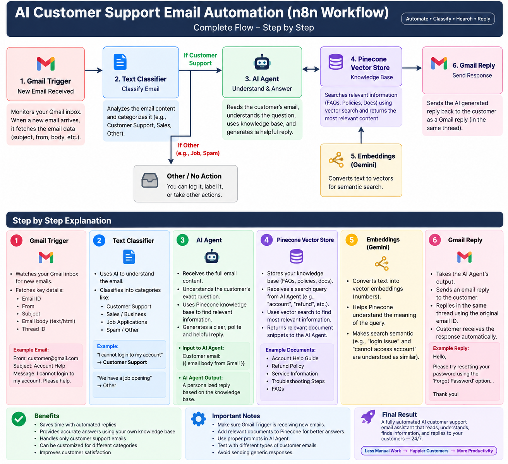

# 🤖 AI Customer Support Automation

An AI-powered customer support email automation workflow built using **n8n**.

This workflow automatically receives customer support emails, understands the customer's issue using an AI Agent, generates a contextual response, and replies automatically through Gmail.

---

## 🚀 Project Overview

Customer support teams often receive repetitive emails and queries. Responding manually to every email can be time-consuming.

This project automates the customer support process using **n8n, Gmail, and AI**.

The workflow reads incoming customer emails, processes the message using an AI Agent, generates a professional response, and automatically replies to the customer.

---

## 📸 Project Screenshots

### 🔹 Complete n8n Workflow



---

### 🔹 ai customer support email automotion



---

### 🔹 Customer Support Email Received


## ⚙️ Workflow Architecture

```text
Gmail Trigger
      ↓
Get a Message
      ↓
Text Classifier
      ↓
AI Agent
      ↓
Reply to a Message
      ↓
Add Customer Support Label
